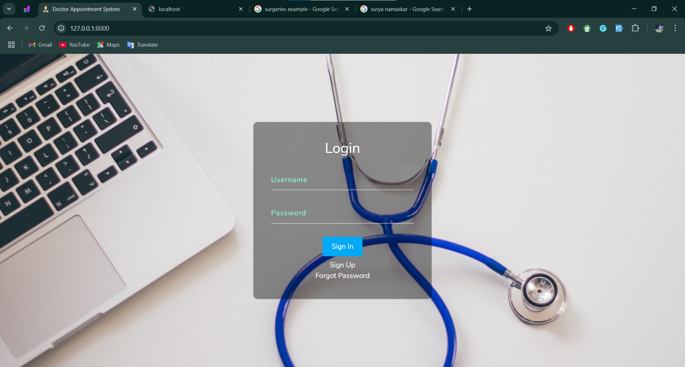
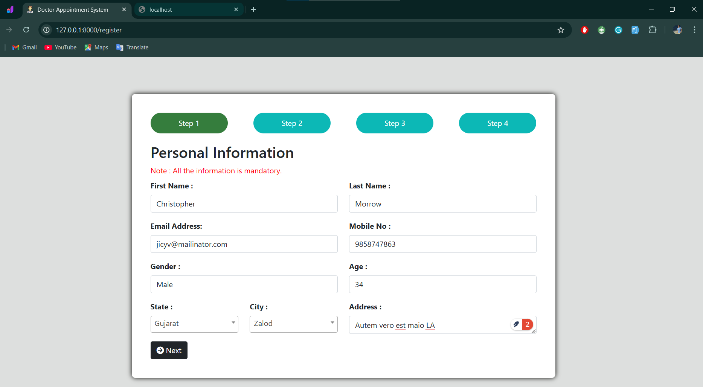
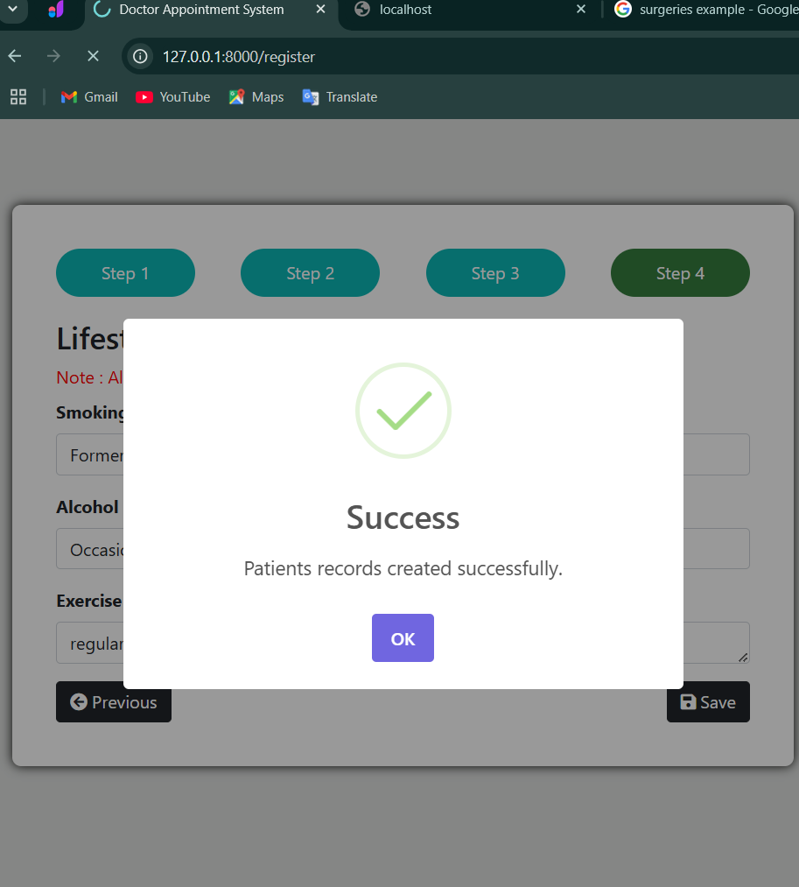
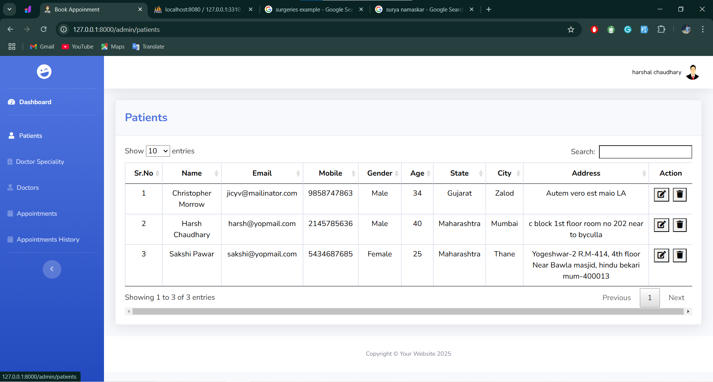
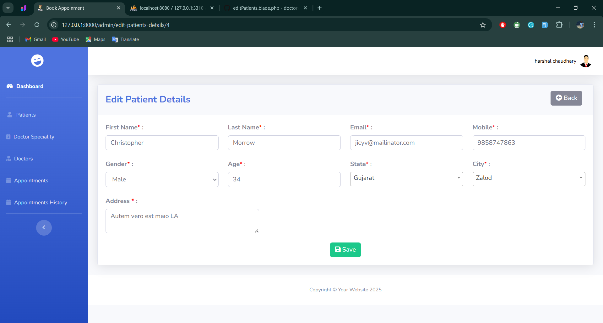

# 🏥 Doctor Management System


## 🚀 About the Project
**Doctor Management System** is a web-based platform built using Laravel that allows patients to book appointments with doctors, doctors will manage the appountments, and make online/offline payments. Doctors can access patient records, view upcoming appointments,  reschedule the apponintments and mark offline payments. Admins can oversee the system and appointments, and monitor activities.

---

## 🏆 Key Features

### **🩺 For Patients**
✅ Register & Login  
✅ Book Appointments Online  
✅ View & Cancel Appointments  
✅ Online Payment via Razorpay    

### **👨‍⚕️ For Doctors**
✅ View & Manage Appointments  
✅ Access Patient Details  
✅ Approve or Cancel Appointments  
✅ Mark Offline Payments  
✅ View Payment Summary  

### **🛠️ For Admins**
✅ Manage Doctors Specialty  
✅ Manage Doctors & Patients  
✅ View All Appointments and Take Appropriate Action  
✅ Mark Offline Payments 

---

## 🛠️ Technology Stack

- **Backend:** Laravel 10 (PHP 8.1)  
- **Database:** MySQL 8.0  
- **Frontend:** Blade Templates, Bootstrap, Javascript, Jquery
- **Payment Gateway:** Razorpay  
- **Authentication:** Laravel UI  

---

## 🔧 Installation & Setup

### **Step 1: Clone Repository**
```sh
git clone https://github.com/har9721/doctor-appointment-system.git
cd doctor-management-system
```

### **Step 2: Install Dependencies
```sh
composer install
npm install
npm run dev
```

### **Step 3:Configure Environment
```sh
cp .env.example .env
php artisan key:generate
```

Edit **.env** and configure your database and razorpay payment gateway credentials.

### **Step 4:Run Migrations & Seed Data
```sh
php artisan migrate --seed
```

### **Step 5:Start Development Server
```sh
php artisan serve
```

---

### **📌 Usage**
1️⃣ **Login Credentials**
🔹 Admin: admin@yopmail.com/ 12345678. 
🔹 Doctor: create a new doctor from admin login and default password is 12345678.
🔹 Patient: register as a new patient and default password is 12345678. 

2️⃣ **Booking Appointment**
🔹 Patients log in, apply filter according to their need and book an appintment. 
🔹 They can select a date and available time slot. 
🔹 Patient and Doctor both will receive mail. 

3️⃣ **Paymet System**
🔹 Patients can pay the fees online via Razorpay. 
🔹 Admin and Doctors can mark offline payments as completed.
🔹 Mailed patients to remind them to pay if he hadn't.

4️⃣ **Appointment Management**
🔹 Doctors can approve/cancel/reschedule the appointment.
🔹 Admin can also approve/cancel/reschedule the appointment in the absence of doctors.
🔹 Patients can cancel appointments before confirmation.

5️⃣ **Viewing Medical History**
🔹 Doctors can access patient details.

---

## 📸 Screenshots

### 1️⃣ Loin Page


### 2️⃣ Patients Registration Form





### 3️⃣ Admin Login
👉 **Patients**



---

🔮 Upcoming Features
🚀 **Maintain Patient Medical History –** Store and track past diagnoses, treatments, and reports.
🚀 **Doctor Prescriptions –** Doctors will be able to add prescriptions, and the system will automatically email them to patients.
🚀 **Automated Appointment Reminders –** Patients will receive email/SMS reminders before their appointments.
🚀 **Doctor Availability Calendar –** Patients can view real-time doctor availability before booking an appointment.
🚀 **Admin Dashboard Enhancements –** Graphs and reports for better system insights.

---

### 📜 License
This project is licensed under the MIT License.

### 🔗 Contact
👤 Harshal Chaudhary
📧 Email: harshalchaudhary21@gmail.com
🔗 Discord: harshal_21_11930

