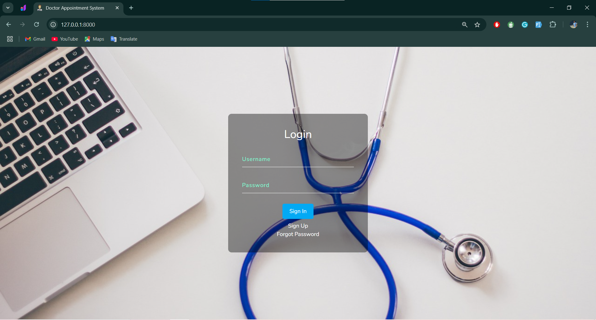
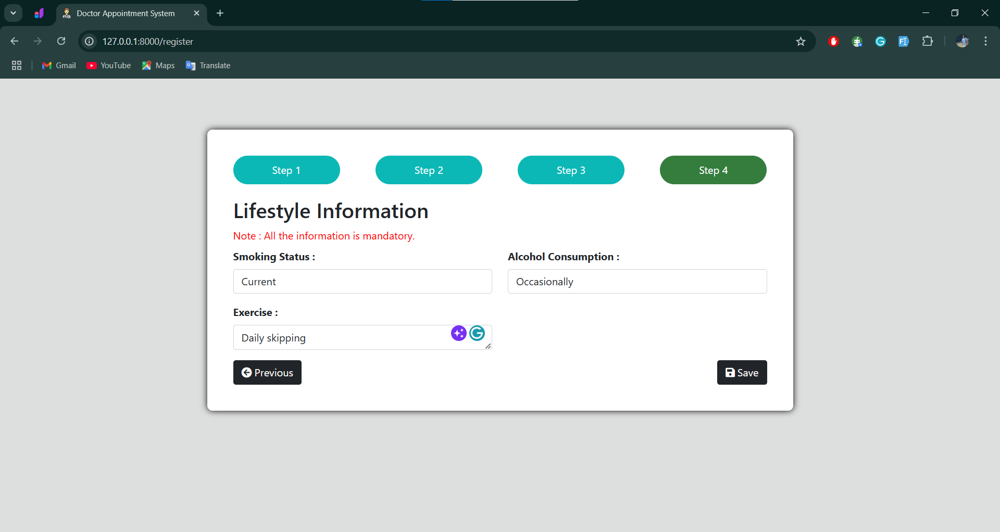
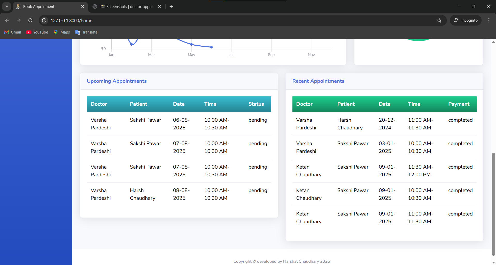
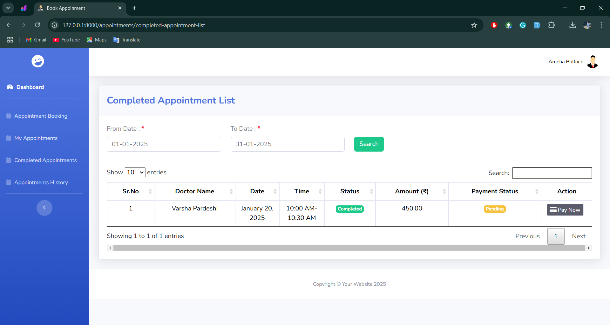
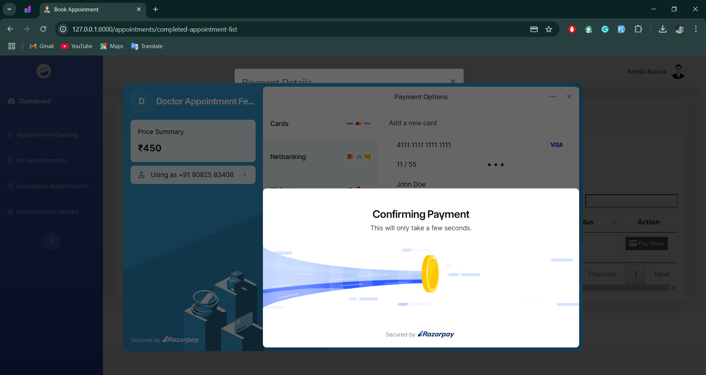

# 📸 Screenshots

## 👤 Login

---

## 👤 Register

---

## 🏠 Admin Dashboard

## 🏠 Doctor Dashboard

## 🏠 Patient Dashboard

---

## 📅 Appointment Booking

---

## 📅 Appointment Management

---

## ⏰ Manage Doctor Availability

---

## 💳 Payment Page

## 📜 Prescriptions

